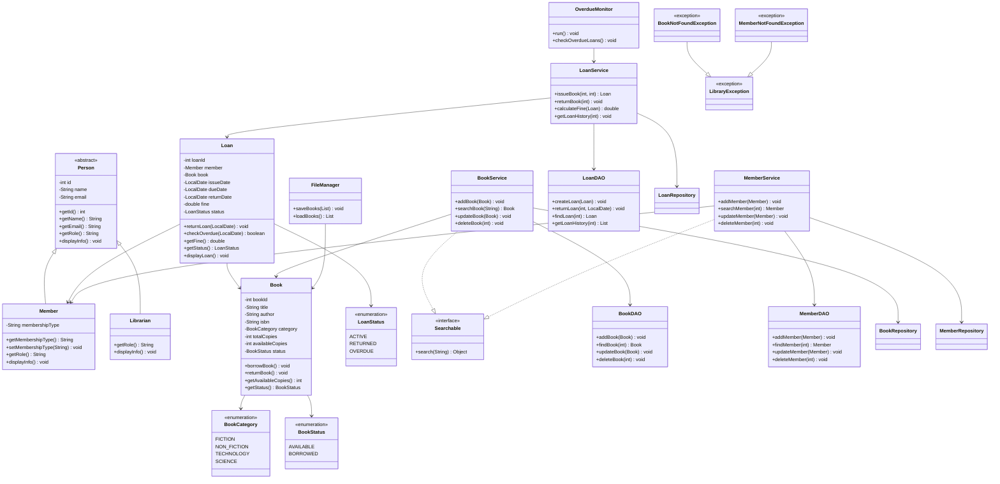

# Smart Library Management System - Class Diagram

## Class Diagram Description

### Person
Abstract base class containing common information such as ID, name, and email.

### Member
Extends `Person` and represents a library member.

### Librarian
Extends `Person` and represents the librarian using the system.

### Book
Stores book information including title, author, ISBN, category, total copies, available copies, and status.

### Loan
Represents a book issued to a member. It maintains issue date, due date, return date, fine, and loan status.

### Service Classes
The service layer contains the main business logic:

- `BookService` manages books.
- `MemberService` manages members.
- `LoanService` manages book issue, return, and fines.
- `OverdueMonitor` checks overdue loans.

### DAO and Repository Classes
These classes provide data-access functionality between the service layer and persistent storage.

### Interfaces and Exceptions
`Searchable` demonstrates interface-based abstraction. Custom exceptions such as `BookNotFoundException` and `MemberNotFoundException` provide meaningful error handling.

### Enumerations
The project uses enumerations to represent:

- `BookCategory`
- `BookStatus`
- `LoanStatus`