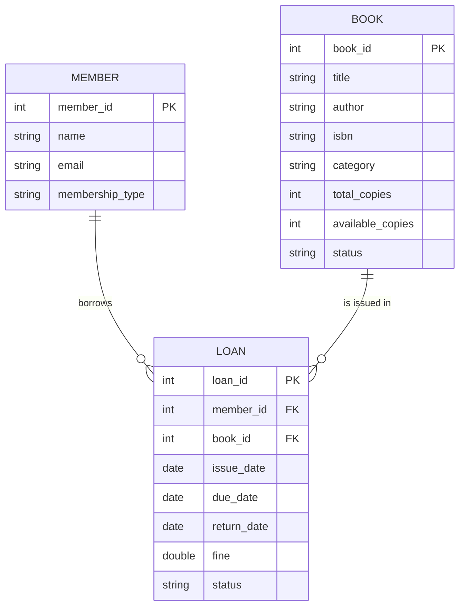

# Smart Library Management System - Database ER Diagram

## Entity Description

### MEMBER

Stores information about library members.

- `member_id` - Unique member identifier.
- `name` - Member name.
- `email` - Member email address.
- `membership_type` - Type of membership.

### BOOK

Stores information about books available in the library.

- `book_id` - Unique book identifier.
- `title` - Book title.
- `author` - Book author.
- `isbn` - ISBN number.
- `category` - Book category.
- `total_copies` - Total number of copies.
- `available_copies` - Number of currently available copies.
- `status` - Current book status.

### LOAN

Stores information about books issued to members.

- `loan_id` - Unique loan identifier.
- `member_id` - References the member who borrowed the book.
- `book_id` - References the borrowed book.
- `issue_date` - Date when the book was issued.
- `due_date` - Expected return date.
- `return_date` - Actual return date.
- `fine` - Overdue fine amount.
- `status` - Current loan status.

## Relationships

- One **Member** can have multiple **Loans**.
- One **Book** can appear in multiple **Loans** over time.
- Each **Loan** belongs to one Member and one Book.

## Database Technology

The project uses **SQLite** for persistent storage and **JDBC** for communication between the Java application and the database.