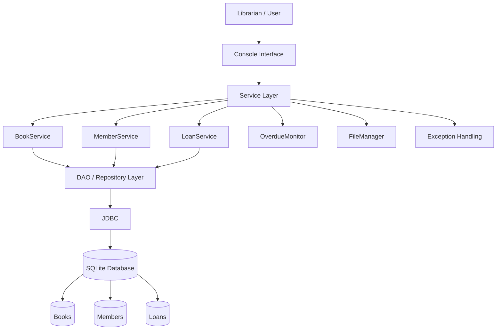

# Smart Library Management System - System Architecture

## Architecture Components

### 1. Console Interface
Accepts commands and input from the librarian or user and displays results.

### 2. Service Layer
Contains the main business logic of the application.

- BookService - manages books
- MemberService - manages members
- LoanService - handles issue and return operations
- OverdueMonitor - checks overdue loans

### 3. DAO / Repository Layer
Handles data-access operations between the application and the database.

### 4. JDBC
Provides connectivity between Java and the SQLite database and executes SQL queries.

### 5. SQLite Database
Stores persistent records for:

- Books
- Members
- Loans

### 6. FileManager
Provides file-based data handling for book information.

### 7. Exception Handling
Handles errors such as missing books, missing members, unavailable copies, and invalid operations.