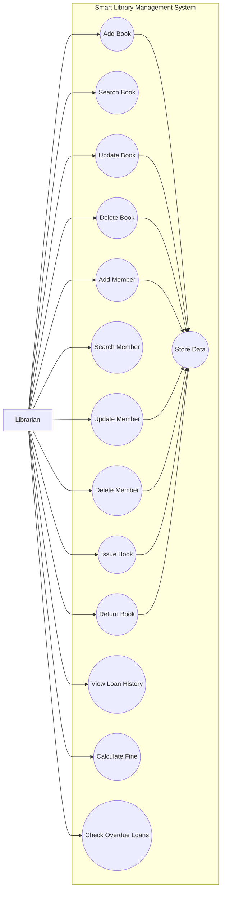

# Smart Library Management System - Use Case Diagram

## Actors

### Librarian

The librarian is the primary actor who interacts with the system to manage books, members, and loans.

## Main Use Cases

### Book Management
- Add books
- Search books
- Update book details
- Delete books
- Manage available copies

### Member Management
- Add members
- Search members
- Update member details
- Delete members

### Loan Management
- Issue books
- Return books
- View loan history

### Fine Management
- Calculate overdue fines
- Check overdue loans

### Data Storage
The system stores library records persistently using the SQLite database.